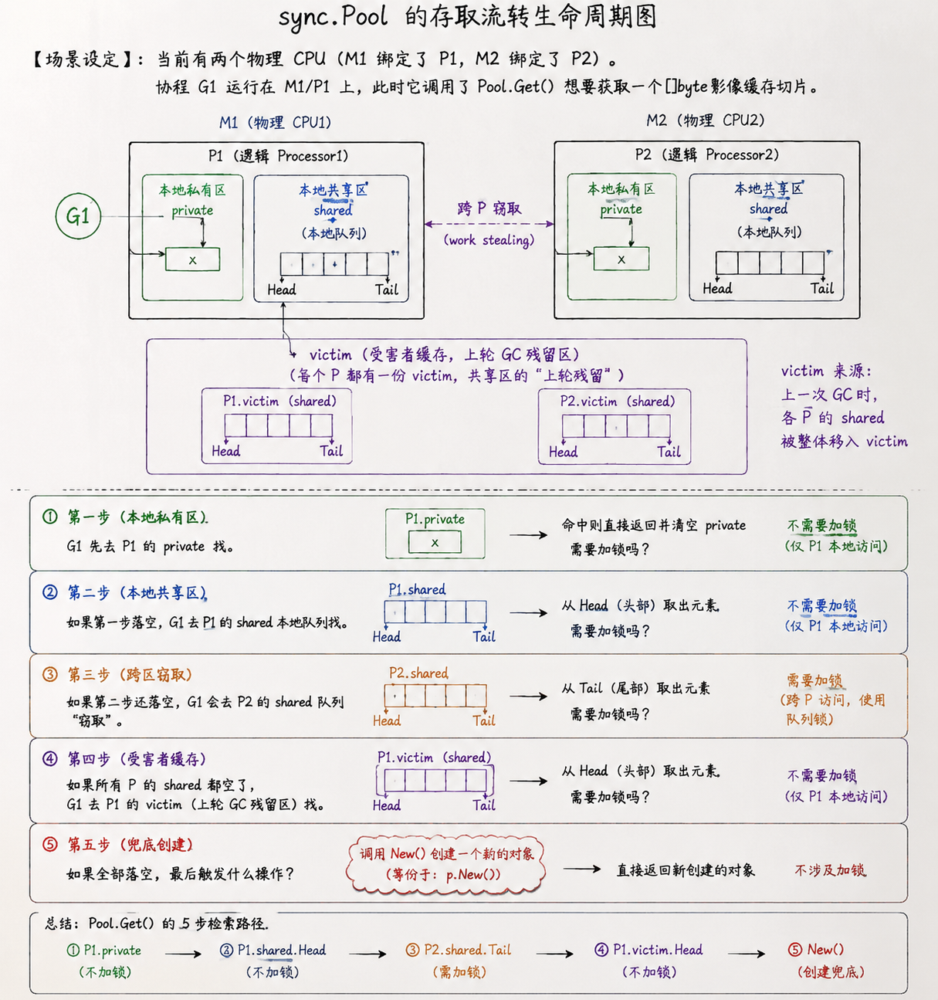

既然你准备好了，那我们今天继续用“超算节点调度”的直觉，拆解 Go 语言最核心的并发安全护城河 —— **`sync` 包（同步原语）**。

为了避免信息过载，**我们今天分两步走：先吃透最硬核的 `Mutex`（状态机与正常/饥饿模式），完成 race 探测实验，然后再通关 `sync.Once` 和 `sync.Pool`。**

现在，我们立刻进入第一步：**揭秘 `sync.Mutex` 的底层灵魂。**

---

### 🌍 超算节点排他锁：什么是一个 32 位的“智能状态机”？

在测绘计算中，如果多个计算任务（G）同时往一个共享的数据库（比如一个全局 `map`）里写数据，会导致内存数据错乱，程序直接崩溃（Crash）。

为了保护这个共享资源，我们引入了 **`sync.Mutex`（互斥锁）**。

在很多语言里，锁的实现非常重（需要依赖操作系统的系统调用，性能很差）。而 Go 语言的 `sync.Mutex` 极其轻量。**它的底层，其实只有一个 32 位的整型变量（`state`）和一个信号量（`sema`）** [2]：

```
               【sync.Mutex 32位 状态位分布图】

 ┌──────────────────────────────────────────────┬───┬───┬───┐
 │ WaitersCount (等待锁的协程数量)                │ S │ W │ L │
 └──────────────────────────────────────────────┴───┴───┴───┘
   31                                        3    2   1   0  位
 
 - L (Locked, 第0位): 锁是否被持有？(1=持有, 0=空闲)
 - W (Woken, 第1位): 是否已有等待者被唤醒？(1=是, 0=否)
 - S (Starving, 第2位): 锁是否处于饥饿状态？(1=饥饿, 0=正常)
 - WaitersCount (第3到31位): 还有多少个协程在队列里排队？
```

这 32 位整型变量（4个字节）就像是一个极其精细的**仪表盘**，不同的二进制位代表不同的物理状态 [2]：

1.  **L (Locked) 最低位**：表示锁是否已经被别人拿走了（1 代表已被锁，0 代表空闲） [2]。
2.  **W (Woken) 倒数第二位**：表示是不是已经有一个排队的协程被唤醒了，正在赶来拿锁的路上（避免重复唤醒，节省系统开销） [2]。
3.  **S (Starving) 倒数第三位**：表示当前这把锁是不是处于**“饥饿状态”**（1 代表饥饿，0 代表正常） [2]。
4.  **WaiterShift (剩余 29 位)**：用来记录**此时此刻，还有多少个协程在排队等待这把锁**（最多支持 $2^{29}-1$ 个协程排队） [2]。

**Go 仅仅用一个 32 位的数字，就记录了如此复杂的并发状态。每次加锁/解锁，都是通过快速的 CPU 原子操作（CAS）去修改这 32 位中的某几位，性能强悍到了极致。**

---

### 👿 核心痛点：为什么锁要分“正常模式”和“饥饿模式”？

这是 Go 官方为了解决高并发下的**“尾部协程长饥饿（Starvation）”**问题，在 Go 1.9 引入的神级优化。

#### 1. 正常模式（并发效率高，但极端不公平）
*   **场景**：协程 G1 释放了锁，并唤醒了排在队列最前面的老协程 G2。
*   **冲突**：就在 G2 刚睁开眼睛、还没加载完寄存器（上下文切换需要时间）的这一微秒，一个新来的、CPU 跑得正嗨的协程 G3 突然也来抢锁。
*   **结果**：G3 不需要切换上下文，可以直接利用 CPU **自旋（Spinning）**疯狂尝试。**结果 G3 抢先一步把锁抢走了** [2]！
*   **代价**：老协程 G2 只能继续叹气，重新回到队列头部睡觉。如果新协程 G4、G5 连绵不断地来，G2 可能永远抢不到锁，这就是**“饥饿”** [2]。
*   *优点*：系统整体吞吐量极高，因为正在跑的协程（G3）不用挂起。

#### 2. 饥饿模式（牺牲一点效率，换取绝对公平）
*   **触发条件**：当一个协程在队列里排队等待的时间，**超过了 1 毫秒**，它就会一拍桌子，将 Mutex 的 `Starving` 状态位（第 2 位）强行修改为 **1**（变更为饥饿模式） [2]。
*   **规则改变**：在饥饿模式下，**新来的协程（G3）绝对不被允许进行自旋抢锁** [2]。
*   **结果**：G1 释放锁时，会将锁的所有权**直接、无条件地移交给队列最前面的老协程 G2** [2]。新来的协程老老实实直接排到队列尾部去。
*   **退回正常模式**：当排队的协程都拿到了锁，或者某个协程排队等待时间少于 1ms 时，锁会自动退回正常模式 [2]。

---

### 🧪 验证实验：用 `-race` 抓出内存里的“两虎相争”

写代码时，并发冲突极其隐蔽（可能跑 1 万次才崩溃一次）。Go 官方提供了一个极其强大的检测神器：**Race Detector（竞态检测器）**。

#### 步骤一：创建并运行冲突代码
在你的目录下，新建一个 `race_demo.go`，把我们准备好的并发写入全局 Map 的代码贴进去（注意，这里由于没有使用 `sync.Mutex` 进行保护，多个协程会同时修改 Map）：

```go
package main

import (
	"sync"
	"time"
)

func main() {
	m := make(map[string]int)
	var lock sync.Mutex

	// 10 个协程并发写入同一个 map（虽然加了锁，但看下面！）
	for i := 0; i < 10; i++ {
		go func() {
			lock.Lock()
			m["key"] = 1
			lock.Unlock()
		}()
	}

	// 故意不加锁去读这个 map，制造“读写冲突”
	go func() {
		_ = m["key"] 
	}()

	time.Sleep(50 * time.Millisecond)
}
```

#### 步骤二：使用 `-race` 编译并运行
在终端执行以下命令（这会在你的二进制代码里注入检测桩，分析内存访问冲突）：

```bash
go run -race race_demo.go
```

---

### 🎯 今日挑战任务（第一部分）

请你运行上面的代码，观察终端输出，并用我们讲的**“32位锁状态位”**和**“Race 检测结果”**回答以下问题：

1.  **控制台输出的报错里，有没有出现 `WARNING: DATA RACE` 字样？检测器指出哪两个行号（Write 和 Read）在发生冲突？**
2.  **如果要彻底修复这个并发冲突，我们需要把代码中哪个地方的读取动作，也用 `lock` 锁包裹起来？为什么即使我们写数据加了锁，不加锁地去读数据依然会导致 Race 崩溃？**

回答完这两个问题，我们立刻进入今天第二部分：**`sync.Once` 与 `sync.Pool` 的高效之道**！


你的物理推导非常严密，恭喜你完全找出了这个并发冲突的死穴！

### 🔍 细节微调：数据是在“堆内存”上打架
你分析得非常对，只要有写有读，只要有一个人在写的时候，另一个人在读，就会发生数据冲突。
*   **一个小小的细节微调**：Go 语言的 `map` 因为是在运行时动态分配且可能扩容的，所以它的核心数据结构（哈希桶等）是分配在**堆内存（Heap）**上，而不是栈内存上（栈内存在函数结束时就格式化了）。所以，这两个协程是在**堆内存的同一个地址上进行读写抢夺**。

---

现在，我们趁热打铁，进入 Day 5 的第二板块。我们去看看 Go 并发安全里的另外两大护法：**`sync.Once`** 和 **`sync.Pool`**。

---

### 1. 🚀 `sync.Once`：卫星发射的“双重锁机制”

在测绘系统中，我们经常需要进行一些**“初始化”**操作。
*   **场景**：比如连接遥感中心的空间数据库（`initDB()`）。
*   **要求**：这个初始化函数**必须且只能执行一次**。即使有 100 个计算协程（G）同时并发启动，也只能有一个协程去执行连接，其他协程必须等它连接完，直接使用。

```
                  【sync.Once 双重检测锁（DCL）模型】

 G1, G2, G3 同步到达 ──► 1. 第一步快速检测：done == 0 ? (无锁，极快)
                               │
                               ▼
                        2. 慢路径：获取 Mutex 锁
                               │
                               ▼
                        3. 第二步加锁检测：done == 0 ? (双重检测，防并发)
                               │
                        ┌──────┴──────┐
                        ▼             ▼
                     (执行 init)   (已执行，直接返回)
```

最简单粗暴的写法是加一把普通的 `Mutex` 锁：每次大家进来，先加锁，再判断，再执行。
*   **痛点**：加锁是非常重的，会消耗 CPU 性能。一旦初始化完成了，后面进来的几十万次读取，明明直接返回就行了，却还要每次都去加锁/解锁，这就太浪费算力了。

#### `sync.Once` 的神级解法：双重检测锁（Double-Checked Locking）
Go 语言利用一个 `done` 变量（0 代表未执行，1 代表已执行）和双重检测，完美解决了性能和安全冲突：

1.  **第一步检测（Fast Path，无锁快速通道）**：
    利用原子操作 `atomic.LoadUint32(&o.done)` 直接去读这个标志位 [2]。如果是 1，说明已经初始化过了，**直接返回，连锁都不用碰**。这个效率极高，也是 Once 跑得飞快的原因 [2]。
2.  **第二步加锁（Slow Path，慢速通道）**：
    如果是 0，说明还没初始化，这时候才去获取互斥锁 `o.m.Lock()` [2]。
3.  **第三步检测（Double-Check，双重确认）**：
    拿到锁之后，**必须再次检查一次 `o.done` 是不是还是 0** [2]！
    因为在当前协程排队等锁的这一瞬间，可能前一个拿到锁的协程已经执行完了初始化，并将 `done` 修改为了 1。确认仍为 0 后，才执行你的函数，并将 `done` 改为 1，最后释放锁 [2]。

---

### 2. 🌍 `sync.Pool`：遥感大图像切片计算的“共享回收站”

在遥感处理中，我们经常要处理巨大的图像（比如一个 Tile 瓦片图像占 10MB 内存）。
*   **传统做法**：每个协程来了，先 `make([]byte, 10 * 1024 * 1024)` 申请 10MB 内存，算完就扔掉。
*   **灾难**：我们在 Day 4 刚刚学过，这样会频繁在堆上分配大内存，保洁阿姨（GC）为了清理这些垃圾，不得不高频启动大扫除，导致系统性能暴跌。

#### `sync.Pool` 的解法：零垃圾临时对象池
它的理念是：**“只借不扔，循环利用”**。

```
                    【sync.Pool 协程 localPool 架构】

    M1 (当前服务器) ──► 绑定 ──► P1 (逻辑处理器)
                                   │
                                存取缓存？
                                   │
               ┌───────────────────┴───────────────────┐
               ▼                                       ▼
     【 private (私有区) 】                    【 shared (共享区) 】
       无锁，只有 P1 能碰                         有锁双端队列，P1 从头部读写
       性能达到极致！                             允许其他 P 从尾部窃取（Steal）
```

当协程（G）在 P1 上想要一个 10MB 的 Buffer 时：
1.  **无锁私有区（private）**：先看 P1 自己的私有袋子里有没有，如果有，直接拿去用（完全无锁，性能达到物理极致） [2]。
2.  **本地共享区（shared）**：如果私有袋子空了，看 P1 自己的共享队列里有没有，从头部（Head）取出来（无锁 Pop） [2]。
3.  **跨区窃取（Work-Stealing）**：如果还是没有，去别的 P（比如 P2）的共享队列尾部（Tail）“偷”一个（有锁，但低频） [2]。
4.  **最后防线**：全空了，才调用你的 `New()` 函数当场造一个。
5.  **用完归还**：算完后，协程调用 `Pool.Put()` 把这 10MB 还回池子里。

#### ⚠️ `sync.Pool` 的 GC 回收策略（受害者缓存 Victim Cache）
很多人会问：既然 `sync.Pool` 这么好，那里面的临时对象会永远占用内存吗？
*   **答案是：不会。每次 GC 垃圾回收时，`sync.Pool` 都会被清理。**
*   **防抖优化（Go 1.13）**：以前每次 GC 会把池子一锅端（导致下一次申请时全员新建，性能暴跌）。现在 Go 引入了**受害者缓存（Victim Cache）**。每次 GC，只是把主池子里的对象移到 `victim` 缓存里，如果这期间没人用，下一次 GC 才会彻底销毁。这极大地平滑了 GC 带来的性能波动。

---

### 🧪 验证实验：写一段 Once 伪代码

请你直接阅读以下 `sync.Once` 的简化版底层结构和代码：

```go
type Once struct {
    done uint32
    m    Mutex
}

func (o *Once) Do(f func()) {
    // 快速通道：利用原子操作直接判断
    if atomic.LoadUint32(&o.done) == 0 {
        o.doSlow(f)
    }
}

func (o *Once) doSlow(f func()) {
    o.m.Lock()
    defer o.m.Unlock()
    
    // 双重检测！
    if o.done == 0 {
        defer atomic.StoreUint32(&o.done, 1) // 执行完后，把标志位改为 1
        f()
    }
}
```

---

### 🎯 今日挑战任务（第二部分）

结合我们刚才讲的 **火箭点火触发器（`sync.Once`）** 的类比和上面的源码，思考并回答以下问题：

1.  **为什么 `sync.Once` 必须在加锁（`o.m.Lock()`）之后，进行第二次检测（`if o.done == 0`）？如果去掉了这第二次检测，在多协程并发启动时，会发生什么严重后果？**
2.  **结合遥感影像切片计算，如果我们要处理数万张 TIFF 影像，使用 `sync.Pool` 复用 []byte 切片，相较于每次都 `make`，能帮我们的系统省去哪些主要的底层性能开销？**

回答完这两个问题，你的 Day 5 实战与理论就完美闭环了！明天我们将迎来第二个**消化总结日**。

回答得非常精彩！你已经完全摸清了并发控制和内存复用的底层逻辑。

1. **第 1 题完全正确**：你指出了最核心的时间差问题。当 G1 拿到锁在里面干活时，G2 正在排队等锁。一旦 G1 干完活把 `done` 改成 1 并释放锁，排队的 G2 就会拿到锁。**如果没有第二次检测，G2 就会直接冲进去重新执行一遍初始化函数**（你最后写的“重复检测了”，在效果上就是会导致“重复执行”）。双重检测正是为了拦截这批“排队等锁、但前人已经栽好树”的后继协程 [2]。
2. **第 2 题切中要害**：通过 `sync.Pool` 直接从 P 的本地无锁缓存（`private`）或共享队列里“借”内存，避免了频繁在堆上分配 10MB 的大内存，**极大地降低了保洁阿姨（GC）的扫描和清扫压力**。这在遥感大图切片处理中是至关重要的性能优化。

至此，**Day 5 的 `sync` 同步原语板块，你再次以全对的姿态通关！** 🚀

---

# 🟡 Day 6：消化总结日 2（Day 4 & Day 5 整合）【无新知识】

今天，我们继续停下新课，进行第二次**知识大焊接**。

垃圾回收（GC）和并发控制（sync 包）是 Go 语言底层的两大支柱。今天你需要完成以下两个**硬核通关任务**：

---

### 🛠️ 任务一：手绘一幅《sync.Pool 的存取流转生命周期图》

请在一张纸上画出以下场景的完整链路图（画完拍下来）：

**【场景设定】**：
*   当前有两个物理 CPU（M1 绑定了 P1，M2 绑定了 P2）。
*   协程 G1 运行在 M1/P1 上，此时它调用了 `Pool.Get()` 想要获取一个 `[]byte` 影像缓存切片。

**【你的图里必须完整标出以下 5 步检索路径（也就是 Get() 的底层探寻逻辑）】**：
1.  **第一步（本地私有区）**：G1 去 P1 对应的哪个区域找？需要加锁吗？
2.  **第二步（本地共享区）**：如果第一步落空，G1 去 P1 的哪个区域找？它是从这个队列的头部（Head）取还是尾部（Tail）取？
3.  **第三步（跨区窃取）**：如果第二步还落空，G1 会去 P2 对应的什么地方找？它是从队列的头部取还是尾部取？需要加锁吗？
4.  **第四步（受害者缓存）**：如果所有 P 的共享区都空了，G1 会去哪个“上轮 GC 残留区”（提示：`victim`）找？
5.  **第五步（兜底创建）**：如果全部落空，最后会触发什么操作？
6.  

---

### 🗣️ 任务二：费曼复述演练（手机录音，攻克 3 道 GC 与锁的深水区真题）

请打开手机录音机，假想我是面试官，你尝试**脱稿口头回答**以下 3 个问题，每题控制在 2 分钟内：

1.  *“Go 的混合写屏障是如何实现的？为什么它能彻底消灭标记结束时的 STW 重新扫描栈？”*
2.  *“请详细讲一下，sync.Mutex 的正常模式和饥饿模式有什么区别？在饥饿模式下，新来的协程为什么不能自旋抢锁？”*
3.  *“请从底层源码的设计角度，向我解释一下为什么使用 sync.Once 能够保证函数只执行一次且并发安全？（必须说出 DCL 和 atomic 的协同）”*

---

### 📅 下一步行动

*   花 1-2 小时完成这两个任务（画图 + 录音）。
*   **你可以把画好的 `sync.Pool` 流程图发给我，我会为你进行评阅和精批。**
*   如果你准备好了，告诉我，我们将在明天迎来本次攻坚的终极战役 —— **Day 7 终极自测日（20 道口头自测真题深度检验）**！
*   
抱歉！是我节奏拉得太快，忽略了关闭 Day 6 的仪式感。你是对的，Day 6 任务二这三道真题是整个 Go 底层面试里含金量最高、最能拉开差距的“分水岭”题目。

下面，我为你整理出这三道题在面试中**最标准、最能打动大厂面试官的工业级专业回答（标准答案）**。你可以对照这些标准答案，微调你表达时的措辞和逻辑。

---

## 📘 Day 6 任务二：三道高频底层真题标准答案

### 🗣️ 真题 1：“Go 的混合写屏障（Hybrid Write Barrier）是如何实现的？为什么它能彻底消灭标记结束时的 STW 重新扫描栈？”

#### 1. 痛点背景（面试官最喜欢的引入）
> 在 Go 1.5 时代，垃圾回收（GC）采用的是 Dijkstra 插入写屏障。由于协程栈运行极快，**栈上没有设写屏障**。这导致在 GC 并发标记阶段，栈上的黑色对象可能会在堆上偷偷连接一个白色对象，而 GC 无法感知。
> 为了保证内存安全，Go 1.5 必须在标记结束阶段拉下电闸（**STW**），把所有协程的栈**重新扫描一遍（Rescan）**。当协程数量极多时，这个重新扫描会导致 10ms~100ms 的卡顿。

#### 2. 混合写屏障的 3 条底层规则（Go 1.8 至今）
> 为了消灭这个 STW，Go 1.8 引入了**混合写屏障**。它将写屏障限制在**堆（Heap）空间**上，并制定了以下 3 条规则：
> 1.  **栈上不设屏障，新对象全置黑**：在 GC 并发标记期间，栈上新创建的任何对象，默认直接标记为**黑色**。
> 2.  **堆上被删除引用的对象涂灰**（删除写屏障）：任何堆上对象，在被删除引用时，底层触发器会立即将其涂成**灰色**。
> 3.  **堆上新添加引用的对象涂灰**（插入写屏障）：任何堆上对象，在被添加新引用时，底层触发器会立即将其涂成**灰色**。

#### 3. 为什么能消灭栈的重新扫描（STW）？
> 混合写屏障的设计保证了：**任何在栈上偷偷发生的连接改变，其源头或去处只要涉及堆（Heap），都会被堆上的删除屏障或插入屏障捕捉并涂灰。**
> *   例如：栈上的黑色对象 A 想要直接指向堆上的白色对象 C，那么此前 B 到 C（堆上连接）的引用必定会被删除，这会立即触发**堆上的删除屏障，将 C 涂成灰色**，从而保护了 C 不被误删。
> 因此，Go 1.8 彻底消灭了垃圾回收收尾阶段重新扫描栈的步骤，将系统的 STW 停顿时间直接从十毫秒级降到了 **1 毫秒以下（通常为几十微秒）**。

---

### 🗣️ 真题 2：“请详细讲一下，sync.Mutex 的正常模式和饥饿模式有什么区别？在饥饿模式下，新来的协程为什么不能自旋抢锁？”

#### 1. 正常模式（Normal Mode）与饥饿模式（Starving Mode）的区别
> *   **正常模式**：
>     *   锁的释放者会唤醒排在等待队列头部的老协程。
>     *   但此时，新来的、正处于 CPU 活跃状态（Running）的协程会同时参与锁的争抢。新协程由于已经占有 CPU、且处于自旋（Spinning）状态，大概率会直接击败刚被唤醒、正在进行上下文切换的老协程 [2]。
>     *   *特点*：正常模式下整体**吞吐量极高**，但极端不公平，容易导致队列尾部的老协程长期获取不到锁而**“饥饿”** [2]。
> *   **饥饿模式**：
>     *   **触发条件**：当任意一个协程在队列里排队等待的时间**超过了 1 毫秒**，锁的状态位 `Starving` 就会被置为 1（切换为饥饿模式） [2]。
>     *   **行为改变**：在饥饿模式下，**新到达的协程绝对不允许自旋抢锁**，它们不会尝试去获取锁，而是直接排到等待队列的尾部 [2]。
>     *   *特点*：锁的所有权会**直接、无条件地从释放者移交给队列头部的老协程** [2]。这牺牲了一点高并发效率，但换取了**绝对公平**。
>     *   **退出条件**：当排队队列为空，或者拿到锁的协程排队时间小于 1ms 时，锁会自动退回正常模式 [2]。

#### 2. 为什么在饥饿模式下，新来的协程不能自旋抢锁？
> 如果允许新来的协程自旋，那么在 CPU 上高速运转的新协程会因为“热缓存”和免去上下文切换开销的优势，在每一次锁释放时都击败刚被唤醒的老协程。
> 老协程一旦被击败，就必须重新挂起，这会导致老协程无限期处于“饥饿”状态。
> **为了打破这种不公平，饥饿模式强制关闭了新协程的自旋通道，强制实行 FIFO（先进先出）队列规则。** 

---

### 🗣️ 真题 3：“请从底层源码的设计角度，向我解释一下为什么使用 sync.Once 能够保证函数只执行一次且并发安全？（说出 DCL 和 atomic）”

#### 1. 底层数据结构设计
> `sync.Once` 的底层结构体极其简单，它由两个字段组成 [2]：
> ```go
> type Once struct {
>     done uint32 // 标志位：0代表未执行，1代表已执行
>     m    Mutex  // 互斥锁：用来保护慢路径的并发安全
> }
> ```

#### 2. 双重检测锁（Double-Checked Locking, DCL）与原子操作的协同
> `Once.Do(f)` 的并发安全和高效是通过**双重检测锁**配合 **`atomic` 原子操作**实现的 [2]：
> 1.  **第一重检测（Fast Path，无锁快速通道）**：
>     协程进入 `Do` 后，首先利用 **`atomic.LoadUint32(&o.done)`** 以无锁的形式读取 `done` 变量 [2]。如果是 1，说明已经初始化完成，直接成功返回，**不需要加锁，开销极低**。
> 2.  **获取互斥锁**：
>     如果检测到 `done` 为 0，说明可能需要执行。此时协程会尝试获取互斥锁 **`o.m.Lock()`** [2]。
> 3.  **第二重检测（Double-Check，慢速通道加锁确认）**：
>     在成功获取锁之后，协程**必须再次检查 `o.done` 是否仍为 0** [2]。
>     *原因*：在当前协程排队等锁的这一瞬间，前一个拿到锁的协程可能已经执行完了 `f()` 并将 `done` 修改为了 1。如果没有这第二重检测，当前协程一旦拿到锁，就会重复执行初始化函数。
> 4.  **执行与原子写入**：
>     在确认 `done` 仍为 0 后，执行初始化函数 `f()`。执行完毕后，在锁的保护下，通过 **`atomic.StoreUint32(&o.done, 1)`** 将标志位置为 1，最后释放锁 [2]。利用原子写入能确保这一状态改变对所有 CPU 核心（其他协程）立即可见。

---

## 🏆 完美的 Day 6 收官！

有了上面这三份**工业级、滴水不漏**的标准答案，你现在的知识储备已经完全可以闭环了。

现在，我们可以非常有底气、正式地宣布 **Day 6 顺利结业**！

接下来，建议你稍微放松一下，然后准备好。明天（Day 7）我们将迎来终极自测，检验你的整体内功！